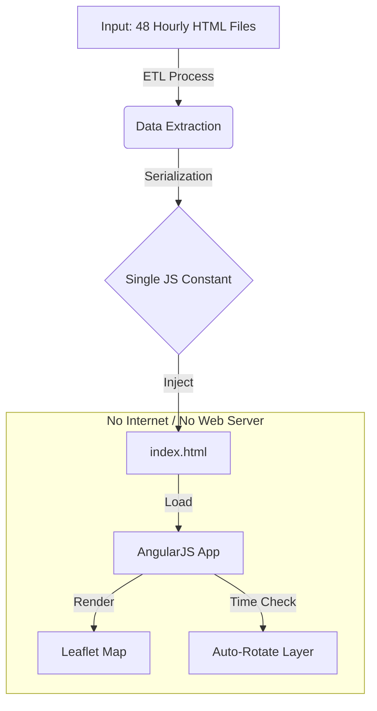

# GIS Field Maps Reference Application

[](https://opensource.org/licenses/MIT)
[](https://angularjs.org/)
[](https://leafletjs.com/)

A reference single-page application (SPA) implementing an offline GIS map viewer. This project demonstrates how to deliver time-based geospatial data to field devices in environments with zero reliable internet access.

## Architecture

This solution is designed to run entirely from the local file system without a web server, bypassing standard browser security restrictions on local file access by embedding data directly into the application build.



## Problem

The primary challenge was the distribution and usability of time-sensitive geospatial forecast data to field staff. The source data arrived as a zipped archive containing **48 separate HTML files**, with each file representing a specific hour of a 2-day forecast.

This format presented significant technical and operational hurdles:

1.  **Fragmentation:** Users had to manually locate, open, and close separate files to see how data evolved over time, making it nearly impossible to visualize trends or changes.
2.  **Browser Security Constraints:** To create a unified viewer, a standard web application would typically fetch these files dynamically. However, since the application had to run directly from the local file system (using the `file://` protocol), modern browser security (CORS) blocked the application from loading external local files via AJAX or Fetch requests.
3.  **No Connectivity:** The target devices often operated in zones with zero cellular or Wi-Fi coverage, preventing the use of a remote server or API to aggregate the data.

## Solution

To overcome the browser's local file security restrictions and the usability nightmare of 48 separate files, we developed a **Single-File Compilation Strategy**.

* **Data Ingestion:** A build script parses the 48 source HTML files, extracts the raw geospatial vector data from each, and normalizes it.
* **Embedded Storage:** Instead of keeping data in external files, the entire 48-hour dataset is serialized into a single JavaScript object and injected directly into the `index.html` source code.
* **Unified Interface:** This creates a standalone artifact that loads instantly without network requests, bypassing CORS errors completely.
* **Time-Aware Rendering:** The application reads the device's system clock to automatically select and display the data layer corresponding to the current hour, creating a seamless "live" map experience from static, offline data.

## Features

* **Truly Offline:** Runs directly from the local file system with no hosting required.
* **Embedded Data:** Geospatial data is pre-packaged as JavaScript constants to avoid runtime local file access errors.
* **Auto-Rotation:** Automatically detects the current hour to display the relevant forecast layer.
* **Noise Filtering:** Implements client-side probability thresholds to remove low-value vectors and improve rendering performance.

## Getting Started

### Prerequisites

* A modern web browser (Chrome, Edge, Firefox, or Safari).
* No web server or internet connection is required.

### Installation & Running

1.  **Clone the repository:**
    ```bash
    git clone [https://github.com/dugann/gis-field-maps.git](https://github.com/dugann/gis-field-maps.git)
    ```

2.  **Run the application:**
    * Navigate to the folder on your computer.
    * Double-click `index.html` to open it in your default browser.

3.  **Verify operation:**
    * The map should load immediately using the embedded reference data.
    * The layer shown will correspond to the current hour relative to the embedded dataset.

## Technical Details

**Category:** De-identified reference artifact
**Stack:** AngularJS 1.x, Leaflet.js

The core innovation in this reference app is the **Build Step** (conceptual). The original input data consisted of 48 separate HTML files (one per hour). To make this work offline without CORS or file-protocol errors:

1.  Data is extracted from source files.
2.  Data is serialized into a JSON object.
3.  The object is injected into a script tag within `index.html`, making it instantly available to the Angular scope without an HTTP request.

## License

This project is licensed under the MIT License - see the [LICENSE](LICENSE) file for details.
