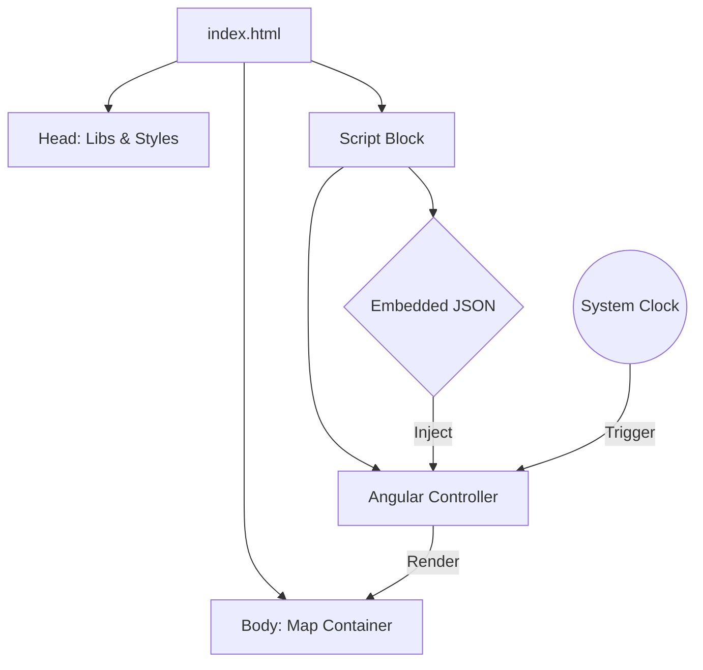

# GIS Field Maps Reference Application

[](https://opensource.org/licenses/MIT)
[](https://angularjs.org/)
[](https://leafletjs.com/)

A reference single-page application (SPA) implementing an offline GIS map viewer. This project demonstrates how to deliver time-based geospatial data to field devices in areas with intermittent connectivity.

[](https://dugann.github.io/gis-field-maps/)

## Architecture

This solution runs entirely from the local file system without a web server. It bypasses standard browser security restrictions on local file access by embedding data directly into the application build.

### Code Structure


## Problem

The client presented me with **48 separate HTML map files**, which they indicated were intended to optimize canvassing operations. These files visualized likely areas of activity using color-coded polylines mapped to the city street grid, with values derived from the client's proprietary predictive analysis.

However, the client provided no guidance on how to effectively distribute these disconnected files or how staff should navigate them while in the field. The files were split into two operational subgroups, **Weekdays** and **Weekends**, with each individual file representing a static snapshot of these pre-calculated probabilities for a specific hour of the day.

Recognizing that standard distribution methods would be too complex for field operations, I took the initiative to consolidate these separate assets into a unified tool, adhering to several constraints:
1.  **No Delivery Mechanism:** There was no existing app or server to host these files.
2.  **Connectivity & Security:** Field staff frequently operate in areas with intermittent connectivity. Relying on network transfers for proprietary data was not viable due to security protocols and reliability concerns.
3.  **Usability:** Requiring users to manually navigate folders and select one of 48 specific files based on the current day and time was impractical.

## Solution

To transform these files into a functional tool, I engineered a **Single-File Compilation Strategy**.

* **Data Ingestion:** I developed a **Python script using Beautiful Soup** to iterate through the 48 source HTML files. This script extracted the location vector arrays from each file and consolidated them into a single JSON object.
* **Embedded Storage:** I bypassed the need for a backend by serializing this combined dataset into a single JavaScript object and injecting it directly into the `index.html` source code.
* **Unified Interface:** This created a standalone tool that loads instantly without network requests. It mitigates security risks associated with data transfer and circumvents browser errors related to local file access.
* **Context-Aware Rendering:** The application reads the device's system clock to determine the current day (Weekday vs. Weekend) and hour, automatically rendering the correct map layer.

## Features

* **Truly Offline:** Runs directly from the local file system with no hosting required.
* **Embedded Data:** Geospatial data is packaged as JavaScript constants to avoid runtime local file access errors.
* **Auto-Rotation:** Automatically detects the current day and hour to display the relevant forecast layer.
* **Noise Filtering:** Implements client-side probability thresholds to remove low-value vectors and improve rendering performance.

## Getting Started

### Prerequisites

* A modern web browser (Chrome, Edge, Firefox, or Safari).
* No web server or internet connection is required.

### Installation & Running

1.  **Clone the repository:**
    ```bash
    git clone [https://github.com/dugann/gis-field-maps.git](https://github.com/dugann/gis-field-maps.git)
    ```

2.  **Run the application:**
    * Navigate to the folder on your computer.
    * Double-click `index.html` to open it in your default browser.

3.  **Verify operation:**
    * The map should load immediately using the embedded reference data.
    * The layer shown will correspond to the current day and hour relative to the embedded dataset.

## Technical Details

**Category:** De-identified reference artifact
**Stack:** AngularJS 1.x, Leaflet.js

The core innovation in this reference app is the **Build Step** (conceptual). The original input data consisted of 48 separate HTML files. To make this work offline without CORS or file-protocol errors:

1.  A Python script (using Beautiful Soup) parses the source files to scrape the raw vector data.
2.  Data is serialized into a JSON object structure reflecting the Weekday/Weekend split.
3.  The object is injected into a script tag within `index.html`, making it instantly available to the Angular scope without an HTTP request.

## License

This project is licensed under the MIT License - see the [LICENSE](LICENSE) file for details.
