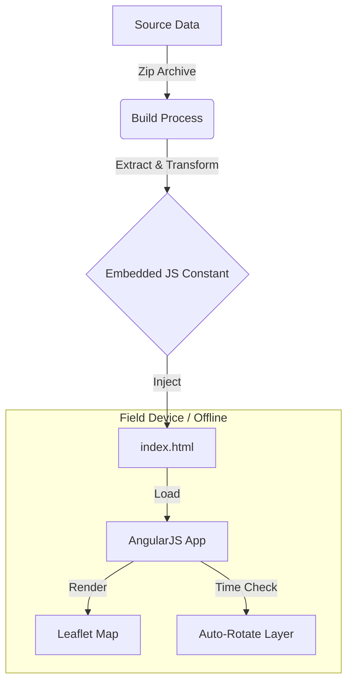

# GIS Field Maps Reference Application

[](https://opensource.org/licenses/MIT)
[](https://angularjs.org/)
[](https://leafletjs.com/)

A reference single-page application (SPA) implementing an offline GIS map viewer. This project demonstrates how to deliver time-based geospatial data to field devices in environments with zero reliable internet access.

## Architecture

This solution is designed to run entirely from the local file system without a web server, bypassing standard browser security restrictions on local file access by embedding data directly into the application build.



## Features

* **Truly Offline:** Runs directly from the local file system with no hosting required.
* **Embedded Data:** Geospatial data is pre-packaged as JavaScript constants to avoid runtime local file access errors.
* **Auto-Rotation:** Automatically detects the current hour (Indianapolis time zone) to display the relevant forecast layer.
* **Noise Filtering:** Implements client-side probability thresholds to remove low-value vectors and improve rendering performance on mobile devices.

## Background

This artifact was created to solve a specific field operation challenge:

| Challenge | Previous Solution (Paper) | New Solution (This App) |
| :--- | :--- | :--- |
| **Updates** | Stale information; difficult to align with current time. | Auto-updates based on system clock. |
| **Usability** | Static; cannot zoom for street-level detail. | Interactive zooming and panning. |
| **Clarity** | Cluttered with low-probability data. | Dynamic filtering of "noisy" data. |

## Getting Started

### Prerequisites

* A modern web browser (Chrome, Edge, Firefox, or Safari).
* No web server or internet connection is required.

### Installation & Running

1.  **Clone the repository:**
    ```bash
    git clone [https://github.com/dugann/gis-field-maps.git](https://github.com/dugann/gis-field-maps.git)
    ```

2.  **Run the application:**
    * Navigate to the folder on your computer.
    * Double-click `index.html` to open it in your default browser.

3.  **Verify operation:**
    * The map should load immediately using the embedded reference data.
    * The layer shown will correspond to the current hour relative to the embedded dataset.

## Technical Details

**Category:** De-identified reference artifact  
**Stack:** AngularJS 1.x, Leaflet.js  

The core innovation in this reference app is the **Build Step** (conceptual). The original input data consisted of 48 separate HTML files (one per hour). To make this work offline without CORS or file-protocol errors:

1.  Data is extracted from source files.
2.  Data is serialized into a JSON object.
3.  The object is injected into a script tag within `index.html`, making it instantly available to the Angular scope without an HTTP request.

## License

This project is licensed under the MIT License - see the [LICENSE](LICENSE) file for details.
